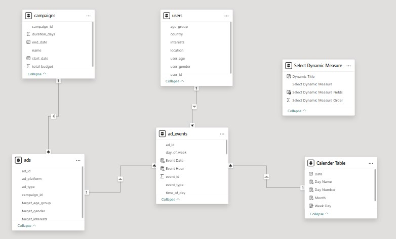
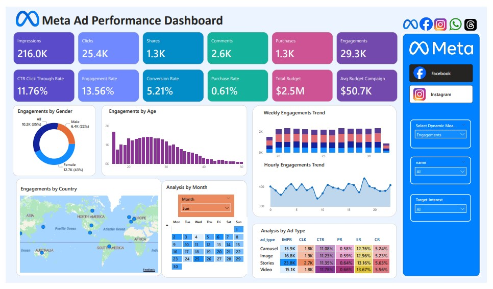
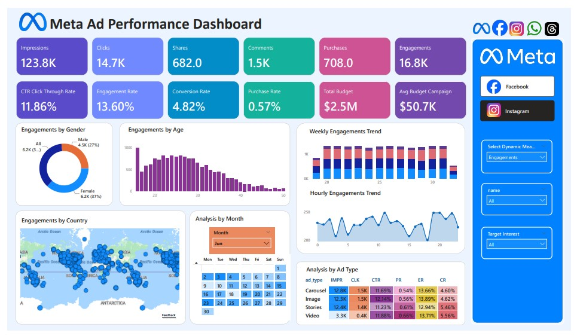

# Meta-Ad-Performance-Dashboard

## Table of Contents
1. [Project Overview](#1-project-overview)
2. [Problem Statement](#2-problem-statement)
3. [Project Tools](#3-project-tools)
4. [Repository Structure](#4-repository-structure)
5. [Dataset Overview & Data Model](#5-dataset-overview--data-model)
6. [Dashboard Overview](#6-dashboard-overview)
7. [Facebook Ads Dashboard](#7-facebook-ads-dashboard)
8. [Instagram Ads Dashboard](#8-instagram-ads-dashboard)
9. [Key Insights](#9-key-insights)
10. [Recommendations](#10-recommendations)
11. [Assumptions & Limitations](#11-assumptions--limitations)
12. [Future Enhancements](#12-future-enhancements)
13. [Author](#13-author)

## 1. Project Overview
This project analyzes digital advertising performance using a simulated Meta (Facebook and Instagram) dataset. The objective is to evaluate campaign effectiveness across the full marketing funnel and generate actionable insights that improve engagement efficiency, optimize budget allocation, and increase conversion performance.

Interactive dashboards were developed to enable stakeholders to analyze performance across audience segments, geographic regions, time periods, and ad formats, to support data-driven decision making.

## 2. Problem Statement
Marketing teams often struggle to identify which campaigns, audience segments, and ad creatives generate the highest (ROI) return on investment. While high engagement may indicate strong user interest, it does not always translate into conversions.

This project addresses this gap by analyzing campaign performance across the full marketing funnel to identify inefficiencies, uncover drop-off points, and highlight opportunities for optimization.

## 3. Project Tools
- Microsoft Power BI – Used for data modeling, DAX calculations, interactive dashboard development, and data visualization.
- Power Query – Used for data loading and validation during the data preparation stage.
- DAX (Data Analysis Expressions) – Used to create calculated measures and KPI metrics such as CTR, engagement rate, conversion rate, and purchase rate.
- Star Schema Data Modeling – Implemented to establish relationships between fact and dimension tables for scalable and efficient analysis.
- Microsoft Excel / CSV Files – Used as the source format for the simulated advertising dataset.

> The dataset was assumed to be clean and analysis-ready; therefore, extensive data cleaning and transformation processes were not required for this project.

## 4. Repository Structure
```text
Meta-Ad-Performance-Dashboard/
│
├── dashboards/
│   └── meta_ad_dashboard.pbix
│
├── data/
│   ├── ad_events.csv
│   ├── ads.csv
│   ├── campaigns.csv
│   └── users.csv
│
├── docs/
│   ├── business-requirements.md
│   ├── cross-platform-analysis.md
│   ├── domain-knowledge.md
│   ├── facebook-insights.md
│   └── instagram-insights.md
│
├── images/
│   ├── facebook.jpg
│   ├── instagram.jpg
│   └── model.jpg
│
├── LICENSE
└── README.md
```

## 5. Dataset Overview & Data Model
### Dataset Overview
-	Ad_Events: impressions, clicks, shares, comments, purchases
-	Ads: platform, format, and targeting attributes
-	Campaigns: budget and duration
-	Users: age, gender, location, interests

This structure enables multi-dimensional analysis across campaign performance, audience behavior, and engagement patterns.

### Data Model
A star schema data model was implemented to support scalable and efficient analysis.
#### Fact Table
-	ad_events – captures all user interactions with ads
#### Dimension Tables
-	ads – ad format, platform, and targeting
-	campaigns – campaign budget and duration
-	users – demographic and interest data



This structure enables end-to-end analysis from ad exposure to conversion across multiple dimensions.

## 6. Dashboard Overview
The dashboard provides a comprehensive view of campaign performance across key analytical dimensions:
-	KPI Overview: impressions, clicks, purchases, CTR, conversion rate
-	Audience Analysis: performance by age and gender
-	Geographic Insights: country-level engagement and conversion patterns
-	Time-Based Analysis: hourly, weekly, and monthly trends
-	Ad Performance Analysis: comparison across formats and platforms

Dynamic filtering allows users to explore performance and identify key drivers of campaign success.

## 7. Facebook Ads Dashboard



### Dashboard Highlights
-	Strong top-of-funnel performance is driven by high CTR and engagement rates, indicating effective audience targeting and creative relevance. 
-	The largest performance drop occurs between click and purchase stages, highlighting lower-funnel conversion inefficiencies. 
-	Video and Stories formats consistently outperform static creatives across engagement and conversion metrics. 

## 8. Instagram Ads Dashboard



### Dashboard Highlights
-	The campaign generates strong engagement and interaction levels, particularly among younger audiences aged 18–30. 
-	Purchase efficiency remains low relative to clicks and engagements, indicating friction within the conversion process. 
-	Video and Stories formats demonstrate stronger conversion-oriented performance, while Image ads contribute most to traffic generation. 

## 9. Key Insights
- The Meta advertising campaigns demonstrated strong top-of-funnel performance, generating high impressions, engagement, and click activity across both Facebook and Instagram.
- Despite strong engagement metrics, both platforms experienced significant drop-off between click and purchase stages, indicating lower-funnel conversion inefficiencies.
- Facebook generated higher overall reach, clicks, and purchases, while Instagram demonstrated stronger engagement intensity and audience interaction behavior.
- Audience engagement across both platforms was concentrated primarily among female users aged 18–30, indicating strong demographic alignment with current campaign creatives and messaging.
- Video and Stories ad formats consistently outperformed static creatives across engagement and conversion metrics, making them the strongest-performing content formats within the campaign ecosystem.
- Geographic analysis showed broad international engagement, with Facebook identifying stronger performance across key markets such as the United States, India, Brazil, Germany, and the United Kingdom.
- Time-based analysis revealed that audience engagement followed predictable activity patterns, with higher interaction levels occurring during peak engagement periods.
- The analysis highlights that campaign targeting and creative execution are effective at generating awareness and interaction, while post-click conversion performance remains the primary optimization opportunity.

## 10. Recommendations
- Optimize landing page performance and purchase flow to reduce friction between click and conversion stages.
- Improve CTA clarity and align landing page messaging more closely with ad creatives to strengthen conversion consistency.
- Increase budget allocation toward high-performing Video and Stories ad formats across both platforms.
- Implement retargeting campaigns focused on users who engaged with ads but did not complete purchases.
- Prioritize high-performing audience segments, particularly female users aged 18–30, while developing tailored creatives for underperforming demographics.
- Concentrate campaign delivery during peak engagement periods to improve budget efficiency and audience responsiveness.
- Scale awareness-focused campaigns in high-engagement regions while strengthening conversion optimization efforts in higher-value markets.

## 11. Assumptions & Limitations

### Assumptions
- The campaign data provided is accurate, complete, and representative of actual Meta advertising performance.
- Engagement, click, and purchase metrics are consistently tracked across both Facebook and Instagram platforms.
- All campaigns operated within the same reporting period and budget structure for valid cross-platform comparison.
- Audience demographic data accurately reflects user behavior and platform interactions.
- Conversion events and purchase tracking were implemented correctly within the advertising environment.

### Limitations
- The analysis is limited to the available campaign data and does not include external business factors such as seasonality, competitor activity, or market trends.
- Customer-level behavioral analysis was not available, limiting deeper attribution and retention insights.
- Profitability metrics such as ROAS, CPA, and customer lifetime value were not included in the dataset.
- Geographic analysis is based primarily on engagement activity and does not include region-level revenue contribution.
- The dashboard focuses on descriptive and comparative analysis rather than predictive forecasting or advanced statistical modeling.
- Attribution across multiple marketing channels outside the Meta ecosystem was not captured within the scope of the project.

## 12. Future Enhancements
- Integrate Return on Ad Spend (ROAS) and Cost Per Acquisition (CPA) metrics for deeper profitability analysis.
- Implement real-time data refresh capabilities to support live campaign monitoring and faster decision-making.
- Add customer journey and attribution analysis to better understand conversion paths across platforms.
- Expand audience segmentation analysis with device type, placement, and behavioral targeting insights.
- Incorporate A/B testing performance tracking for creatives, ad formats, and campaign messaging variations.
- Develop predictive performance models to identify high-converting audience segments and optimize budget allocation.
- Introduce advanced funnel analysis to monitor user progression from impression to purchase in greater detail.
- Extend geographic analysis with region-level profitability and conversion efficiency comparisons.
- Add automated anomaly detection to identify sudden performance drops or spikes across campaigns.
- Enhance dashboard interactivity with drill-through analysis and dynamic filtering capabilities.


## 13. Author
**Godwin Deborah**

Data Analyst
- 🔗 [Linkedin](https://www.linkedin.com/in/godwin-deborah-163b10398/?skipRedirect=true)
- 💼 [GitHub](https://github.com/GodwinDeborah)
- 📧 [Email](mailto:debbiegodwin001@gmail.com)


